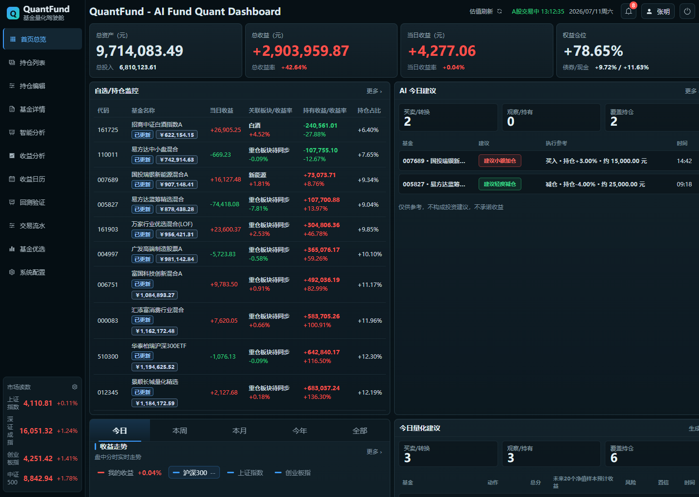
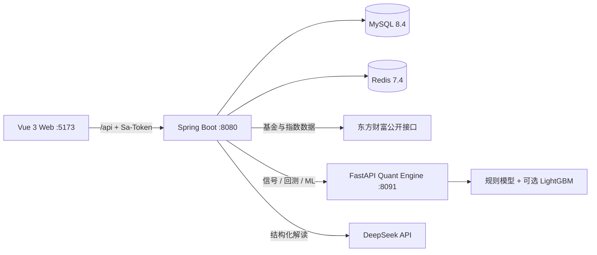
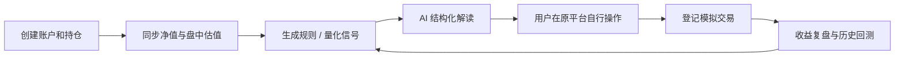

<div align="center">

# QuantFund

**基金数据、持仓管理、规则量化、历史回测、基金优选与 AI 解读的一体化研究驾驶舱**


[核心能力](#核心能力) · [系统架构](#系统架构) · [快速开始](#快速开始) · [使用流程](#使用流程) · [文档导航](#文档导航)



QuantFund 是一个面向个人基金研究和模拟管理的全栈项目。系统从真实基金数据出发，将账户持仓、盘中估值、模拟交易、确定性规则、Python 量化模型、历史回测、基金优选和 DeepSeek 结构化解读串成完整工作流，帮助用户在交易日下午 15:00 前形成可解释、可复核的操作参考。

> [!IMPORTANT]
> QuantFund 不连接券商、支付宝、天天基金等真实下单接口，不会自动交易。所有信号、回测和 AI 内容仅供研究参考，不构成投资建议，不承诺收益。

## 为什么做 QuantFund

基金投资数据常分散在行情平台、交易平台和个人表格中，策略判断也容易停留在一次性的主观结论。QuantFund 尝试解决三个问题：

- **统一数据和持仓**：基金净值、盘中估值、账户、持仓、交易流水和收益复盘集中管理。
- **让建议可解释**：规则引擎给出评分、动作、理由和风险项，AI 只负责结构化解读，不覆盖确定性动作。
- **让策略可验证**：使用历史净值回测、同仓位基准和基金优选前瞻验证检查策略，而不是只看一次信号。

## 核心能力

| 能力 | 说明 |
| --- | --- |
| 基金数据 | 基金搜索、基础资料、历史净值、盘中估值、重仓股、主题、同类排名和缓存降级 |
| 账户与持仓 | 多账户、持仓维护、收益重算、正式净值同步、资产和仓位汇总 |
| 模拟交易与定投 | 买入、卖出、定投、转入、转出、成对转换、在途结算和到期定投补偿 |
| 规则与风控 | 止盈、低吸、仓位监控、风险提醒、个人风险偏好和策略参数 |
| Python 量化引擎 | 多因子评分、单持仓/账户批量信号、基金画像、仓位与市场约束 |
| 历史回测 | 批量回测、净值预热、收益/回撤/夏普/卡玛、逐笔诊断、同仓位基准 |
| LightGBM 辅助 | 可选概率模型和未来收益模型，对规则分数做有限调整并支持 A/B 回测 |
| 基金优选 | 全市场基金池、可投资池过滤、多维因子、质量评分、分级榜单和增量验证 |
| AI 解读 | DeepSeek 结构化报告、历史记录、重新生成和异常时保守 `WATCH` 降级 |
| 驾驶舱与复盘 | 市场状态、仓位分布、收益走势、盘中曲线、盈亏排行和收益日历 |
| 工程安全 | Sa-Token、用户数据隔离、限流、防重复提交、操作日志和敏感字段脱敏 |

前端已经覆盖桌面、平板和手机布局，主要页面包括驾驶舱、持仓、基金详情、基金优选、智能分析、收益分析、收益日历、回测验证、交易流水和系统配置。

## 系统架构



- **`quant-fund-web`**：负责页面、图表、登录态和业务交互；默认连接真实后端，可切换前端 Mock。
- **`quant-fund-server`**：业务核心，负责鉴权、数据隔离、持久化、外部数据、交易闭环、调度、AI 编排和量化调用。
- **`quant-engine`**：独立计算服务，只基于 Java 提供的数据生成信号、回测和 ML 推理，不访问业务数据库或外部基金源。

## 技术栈

| 层 | 技术 |
| --- | --- |
| Web | Vue 3.5、TypeScript、Vite 6、Pinia、Vue Router、Element Plus、ECharts、Vitest、Playwright |
| Server | Java 21、Spring Boot 3.5、MyBatis-Plus、Sa-Token、WebClient、Spring Scheduler、Knife4j |
| Quant | Python 3.11+、FastAPI、Pydantic、NumPy、Pandas、LightGBM、pytest |
| Data | MySQL 8.4、Redis 7.4 |

## 快速开始

### 环境要求

- WSL2 与 Ubuntu
- Docker Desktop，并为 Ubuntu 开启 WSL Integration
- Windows 本机已运行 MySQL 8.4 和 Redis 7.4
- `quant-fund-server/.env` 已配置现有数据库账号、密码和其他私密变量

### 一键启动三个应用

在 Ubuntu WSL 中执行：

```bash
cd /mnt/d/code/personal/quant-fund
docker compose up -d --build --wait
```

Compose 只启动 Vue、Spring Boot 和 FastAPI 三个应用容器。MySQL 与 Redis 继续使用 Windows 现有实例，不会创建数据库容器、执行初始化 SQL 或挂载 Windows 数据目录。

查看状态或停止：

```bash
docker compose ps
docker compose logs -f
docker compose down
```

打开 <http://127.0.0.1:5173>。完整说明见 [WSL Docker 一键启动](docs/deploy/docker-wsl.md)；需要分别启动各服务进行开发调试时，见[本地开发与联调指南](docs/deploy/local-integration.md)。

### 服务地址

| 服务 | 地址 |
| --- | --- |
| Web | <http://127.0.0.1:5173> |
| Server Health | <http://127.0.0.1:8080/api/health> |
| Server Dependencies | <http://127.0.0.1:8080/api/health/dependencies> |
| Knife4j | <http://127.0.0.1:8080/doc.html> |
| Quant Engine Health | <http://127.0.0.1:8091/api/v1/health> |
| Quant Engine Swagger | <http://127.0.0.1:8091/docs> |

## 使用流程



推荐从以下路径开始：

1. 登录后创建账户，通过基金代码或名称搜索基金并加入持仓。
2. 在驾驶舱和基金详情查看估值、净值、仓位、收益、重仓股与市场状态。
3. 对单持仓或账户运行规则/量化分析，再用 AI 页面阅读结构化解释。
4. 在交易流水中登记模拟买卖、定投或转换；系统根据状态更新持仓和账户。
5. 在回测页先拉取本地净值，再验证参数、导出 ML 样本或进行规则/ML 对比。
6. 在基金优选页同步基金池、计算因子与评分，并通过 20/60/120 样本窗口检查分层效果。

## 项目结构

```text
quant-fund/
├─ quant-fund-web/       # Vue 3 前端
├─ quant-fund-server/    # Spring Boot 业务服务
├─ quant-engine/         # FastAPI 量化、回测与 ML
├─ docs/
│  ├─ api/               # API 与模块说明
│  ├─ deploy/            # 本地开发和联调
│  ├─ sql/               # 001~010 数据库脚本
│  ├─ qa/                # QA 记录
│  └─ superpowers/       # 历史设计规格和实施计划
├─ quant-fund-web/qa-artifacts/ # 仅跟踪 README 展示图，其他 QA 产物留在本地
├─ tools/                # 真实基金数据 smoke 脚本
└─ compose.yaml          # Web / Spring Boot / FastAPI
```

## 测试

```powershell
# Java
cd quant-fund-server
mvn test

# Python
cd ..\quant-engine
pytest

# Web
cd ..\quant-fund-web
npm run typecheck
npm run test -- --run
npm run build
```

真实基金数据链路 smoke：

```powershell
node .\tools\real-fund-detail-smoke.mjs
node .\tools\real-fund-holding-smoke.mjs
```

## 文档导航

完整文档索引见 **[docs/README.md](docs/README.md)**。

- [本地开发与联调](docs/deploy/local-integration.md)
- [WSL Docker 一键启动](docs/deploy/docker-wsl.md)
- [项目总体设计](docs/01-project-overall-design.md)
- [后端模块](quant-fund-server/README.md)
- [前端模块](quant-fund-web/README.md)
- [量化引擎](quant-engine/README.md)
- [API 文档](docs/README.md#api-与模块文档)
- [基金优选设计与实施记录](docs/README.md#历史设计与实施记录)

## 当前边界

- 不提供真实交易、资金托管或自动下单。
- 外部基金数据来自公开接口，可能存在延迟、缺失或接口变化。
- LightGBM 默认关闭，规则模型始终是主决策引擎。
- AI 只解释结构化上下文，失败或输出不合法时降级为 `WATCH`。
- 当前 Compose 面向本机 WSL/Docker Desktop 联调，Windows MySQL/Redis 仍需独立维护，不是生产级部署编排。

## License

本项目采用 [Apache License 2.0](LICENSE)。
