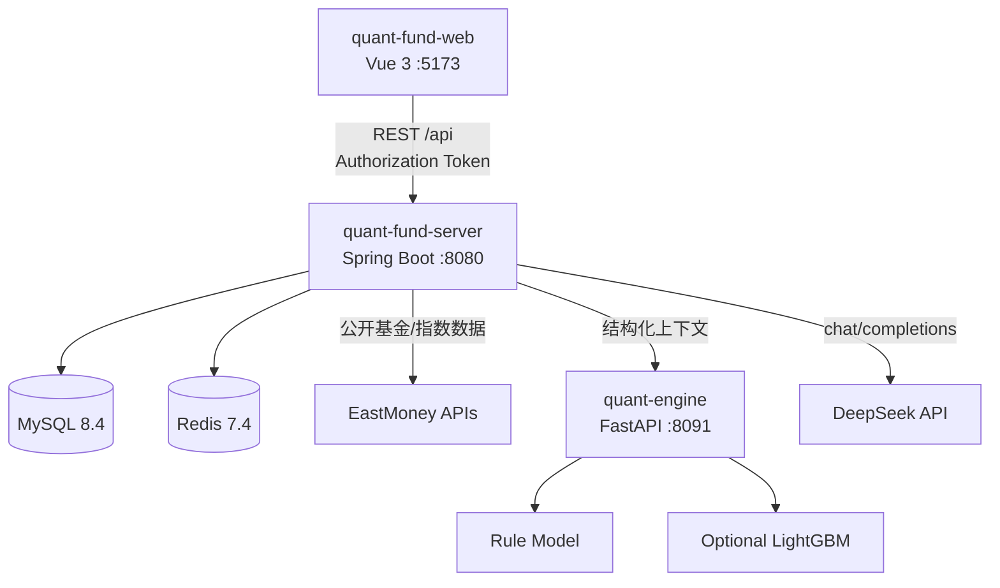
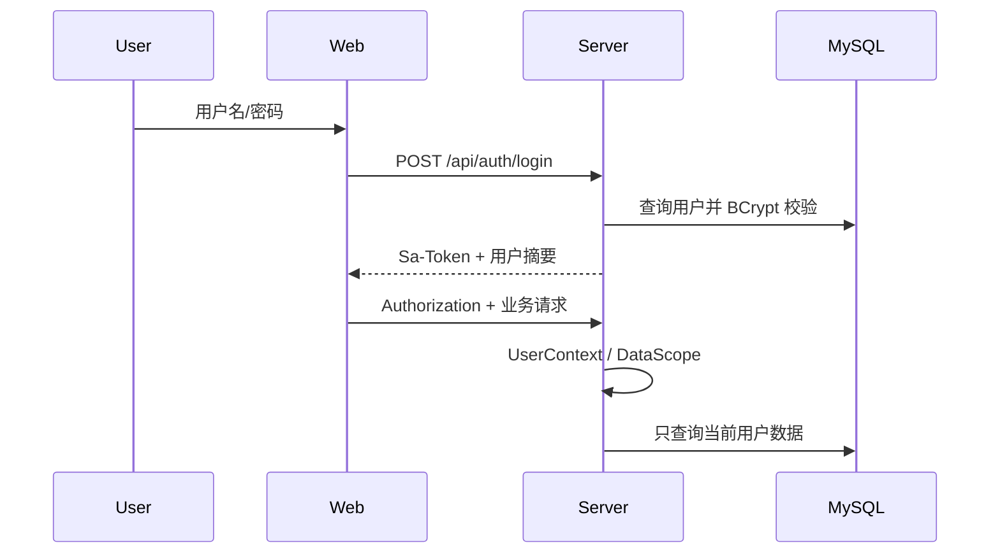
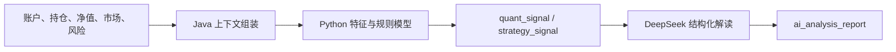
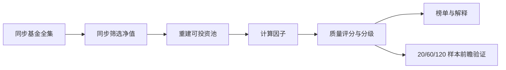

# QuantFund 项目总体设计

本文描述当前代码中的系统边界、服务协作、核心数据流和安全约束。启动步骤见[本地开发与联调](deploy/local-integration.md)，具体接口见[文档中心](README.md#api-与模块文档)。

## 1. 目标与边界

QuantFund 是一个 PC Web 优先、移动端兼容的个人基金研究与模拟管理系统，围绕“数据 → 持仓 → 信号 → 解释 → 模拟记录 → 回测复盘”形成闭环。

系统负责：

- 用户、账户、持仓、模拟交易和定投计划；
- 基金、指数、估值、净值和快照数据；
- Java 业务规则和 Python 多因子量化信号；
- 历史回测、训练样本导出和可选 LightGBM 辅助；
- 基金优选、质量评分和前瞻验证；
- DeepSeek 结构化解读；
- 驾驶舱、收益分析、收益日历和后台任务。

系统不负责：

- 真实资金、交易账户托管或真实下单；
- 对收益、信号准确率或外部公开数据完整性作保证；
- 让大语言模型覆盖仓位、市场或风险硬约束。

## 2. 服务架构



### 2.1 Web

`quant-fund-web` 负责页面、图表、登录态和用户交互：

- Vue Router 定义公开页和需要登录的业务页；
- Pinia 保存 token、用户和驾驶舱状态；
- Axios 统一添加 `Authorization`、解包 `ApiResponse` 并处理 401；
- `quant.ts` 封装后端业务接口，Mock 只作为显式启用的前端演示路径；
- 响应式样式覆盖桌面、平板和手机。

前端不决定数据归属，也不承担业务权限校验。

### 2.2 Server

`quant-fund-server` 是系统业务边界：

- Controller：接收参数、校验并返回统一响应；
- Service：事务、业务编排、当前用户和资源归属；
- Mapper/Entity：MyBatis-Plus 持久化；
- Datasource：外部基金/市场数据、缓存、冷却和日志；
- Strategy：Java 业务规则与风险提醒；
- Quant Client：构造上下文并调用 Python 分析/回测；
- AI：构造 Prompt、调用 DeepSeek、验证 JSON 和降级；
- Scheduler：交易日判断、批处理和任务日志；
- AOP：登录、数据范围、操作日志、限流和防重复提交。

### 2.3 Quant Engine

`quant-engine` 是无业务状态的计算服务：

- 基于净值、市场、仓位和风险数据生成特征；
- 确定性规则模型输出 `BUY`、`SELL`、`HOLD` 或 `WATCH`；
- 批量接口用于账户分析和回测，避免 Java 对大量基金逐只调用；
- 回测只使用请求中的历史净值，不访问外部行情源；
- 可选 LightGBM 输出概率和未来收益参考，并在上限内调整规则分数。

Python 不直接访问业务数据库，不处理用户权限，也不保存最终业务记录。

## 3. 核心数据流

### 3.1 登录与用户数据



后端业务服务始终从登录上下文获取 `userId`。前端请求体不能决定数据所有者。

### 3.2 基金估值与正式净值

```text
手动刷新 / 定时任务
  → 查询需要更新的持仓基金
  → Redis 缓存与手动刷新冷却
  → 东方财富适配器获取估值、净值或指数数据
  → 写入 fund_estimate_intraday / fund_nav_daily / market_index_daily
  → 重算持仓、账户和盘中快照
  → 记录 api_call_log
```

盘中估值只用于当日参考，晚间正式净值同步后重新结算持仓表现。

### 3.3 量化信号与 AI 解读



量化动作由规则和硬约束决定。AI 收到结构化事实、量化结果和近期交易，只负责生成理由、风险和结论；无 Key、超时或 JSON 不合法时保存保守 `WATCH` 降级结果。

### 3.4 模拟交易闭环

```text
用户创建模拟买入/卖出/定投/转换
  → 校验账户、持仓、份额和状态
  → PROCESSING 记录等待确认或到期结算
  → COMPLETED 记录更新持仓份额与成本
  → 重算持仓和账户
  → 写操作日志与页面风险提示
```

定投计划在交易日生成到期记录；异常或停机后可通过补偿接口重新生成和结算。

### 3.5 历史回测

```text
Web 选择账户、区间和参数
  → Java 从本地 fund_nav_daily 组装净值与预热数据
  → Python 批量回测规则模型（可选 ML 对比）
  → Java 保存 quant_backtest_result
  → Web 展示收益、回撤、基准、曲线和逐笔诊断
```

回测同时给出满仓买入持有基准和相同仓位上限基准，后者更适合评价带仓位约束的策略。

### 3.6 基金优选与验证



基金优选使用独立的 screener 表，避免影响用户持仓数据。验证按评分桶聚合未来收益、胜率和显著性，用于判断评分是否具有区分度。

## 4. 模块边界

| 模块 | 负责 | 不负责 |
| --- | --- | --- |
| Auth | 登录、token、用户资料 | 基金业务 |
| Portfolio/Holding | 账户、持仓和收益重算 | 外部行情实现 |
| Trade/Plan | 模拟流水、定投和结算 | 真实下单 |
| Fund Datasource | 外部数据、缓存和日志 | 投资动作 |
| Java Strategy | 业务规则、风险提醒 | 历史批量计算 |
| Quant Engine | 特征、信号、回测和 ML | 权限、业务持久化 |
| Fund Screener | 全市场筛选和验证 | 用户持仓决策替代 |
| AI | 结构化解释和报告 | 覆盖硬约束 |
| Scheduler | 定时同步和批处理 | 页面交互 |
| Web | 展示、输入和图表 | 数据安全边界 |

## 5. 数据设计

数据库按职责分组：

| 分组 | 主要表 |
| --- | --- |
| 用户与权限 | `user_account`、`risk_profile` |
| 账户与交易 | `portfolio_account`、`fund_holding`、`trade_record`、`investment_plan` |
| 基金与市场 | `fund_info`、`fund_nav_daily`、`fund_estimate_intraday`、`market_index_daily` |
| 快照与分析 | `holding_snapshot`、`portfolio_intraday_snapshot` |
| 策略与量化 | `strategy_config`、`strategy_signal`、`quant_signal`、`quant_backtest_result` |
| AI 与日志 | `ai_analysis_report`、`api_call_log`、`operation_log`、`scheduler_task_log` |
| 基金优选 | `screener_fund_universe`、`screener_fund_nav_daily`、`screener_universe_filter`、`screener_factor_snapshot`、`screener_quality_score`、`screener_backtest_result` |

约束：

- 用户级业务表包含 `user_id` 和对应索引；
- 金额、净值、比例使用 `DECIMAL` / Java `BigDecimal`；
- 使用逻辑删除字段 `deleted`；
- 关键快照和验证单元使用唯一索引保证幂等；
- `docs/sql` 按编号维护，当前未使用 Flyway/Liquibase。

## 6. API 设计

- 业务 API 统一以 `/api` 开头，使用 `ApiResponse<T>`；
- 健康、注册、登录和文档是公开路径，其余业务接口默认需要登录；
- HTTP/业务错误由全局异常处理统一转换；
- 写操作按风险使用 `@OperationLog`、`@RepeatSubmit`、`@RateLimit` 和 `@DataScope`；
- API 的实时字段定义以 Knife4j/OpenAPI 为准。

完整分组见[文档中心](README.md#api-与模块文档)。

## 7. 调度设计

Spring Scheduler 使用 `Asia/Shanghai` 时区。总开关控制全部任务，基金优选有独立开关。交易类任务先检查交易日历，所有执行结果写入 `scheduler_task_log`。

任务覆盖定投生成/结算、盘中估值、量化信号、AI 分析、正式净值、持仓快照和基金优选流水线。准确时间见[定时任务文档](api/scheduler.md)。

## 8. 安全与可靠性

- 密码使用 BCrypt，Token 使用 Sa-Token；
- 用户数据由登录上下文和资源归属双重约束；
- 敏感字段在操作日志和外部调用日志中脱敏；
- 外部调用设置超时、缓存、限流或降级；
- Mock 数据必须显式启用，默认不伪装真实基金或 AI 结果；
- 任务失败记录摘要，不因单个基金失败终止整批；
- 所有交易和建议页面显示模拟交易与投资风险提示。

## 9. 部署边界

仓库内 `compose.yaml` 仅启动本地 MySQL 和 Redis。Web、Server 和 Quant Engine 当前以本地开发进程运行；生产部署需要自行补充反向代理、服务守护、密钥管理、数据库备份、监控和多实例调度互斥。
